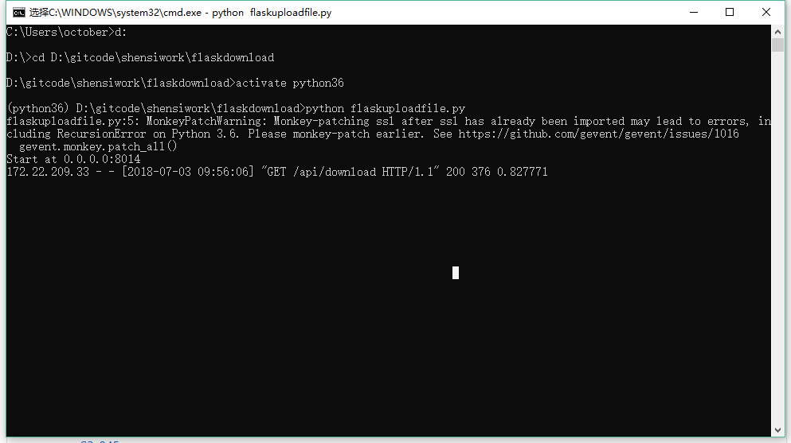

# 前言
前期工作内容，以及以后代码的编写，以后直接创建子级目录并且在readme说明大概意思

### [facebook爬虫](./facebook/)

未完成，待解决中  
难点：ajax的异步请求参数太多，本地js加密未能破解

### [flask文件上传服务(支持异步并发)](./flaskdownload)

使用falsk编写的一个简单的文件上传服务，可以上传指定文件也能通过参数下载指定文件  
flask运行截图:

### [tom邮箱爬虫](./mailspider)

tom邮箱的爬虫，能够下载收件箱邮件保存为eml格式，获取联系人

### [struts2 EXP](./struts2)

一些struts2漏洞的EXP
参考：<https://github.com/Medicean/VulApps>
* [S2-032](./struts2/S2-032)
* [S2-037](./struts2/S2-037)
* [S2-045](./struts2/S2-045)
* [S2-048](./struts2/S2-048)
* [S2-052](./struts2/S2-052)
* [S2-053](./struts2/S2-053)
* [S2-devmode](./struts2/S2-devmode)

### [tweet爬虫](./tweet)

通过tweet搜索爬取tweet的基本信息(文本，头像，图片，连接)  
主要使用scrapy的selector解析html

### [百度贴吧爬虫](./deyang/baidutieba.py)

终于解决了同时爬取帖子楼层和楼层评论的问题，并且对requests.session()的
cookie更新机制有了更深的认识，deyang文件夹下还有些爬虫，对beautifulsoup的使用有了新的理解

### [笔趣阁小说下载器](./noveldownloader/biquge)
笔趣阁的小说下载器  
有不少山寨网站，认准官网  
小说官网：https://www.xbiquge.cc  
下载小说:  
输入小说首页：类似于https://www.xbiquge.cc/book/46840/

# imgtest
Images:

>图为cartman
